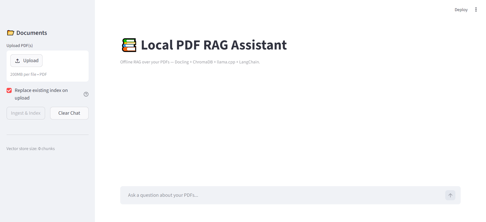

# 🤫 Hushdoc

> **A local-only PDF assistant that keeps every word between you and your machine.**

Privacy-first, fully offline, GPU-accelerated, stateful RAG over your own
PDFs. Nothing about your documents — not the file, not the chunks, not your
questions, not the answers — ever leaves your computer. The only network
call is the one-time HuggingFace download of the embedding / ASR / TTS
models, after which you can run completely air-gapped.

Built on **IBM Docling** (preserves tables, code, LaTeX math; OCRs JPG /
PNG document photos via RapidOCR), **sentence-transformers** +
**ChromaDB** (persistent local vector store), and a local **llama.cpp**
server with any GGUF model. Streamlit UI on top with **token-by-token
streaming**, multi-document scope filtering, automatic **Chinese /
English language matching**, citation-anchored sources, and an **optional
voice mode** (Whisper for speech-in, Kokoro for speech-out). Ragas
evaluation on the side. No cloud, no API keys.

## Architecture

```
   ┌────────────┐    streaming HTTP / OpenAI API    ┌──────────────────┐
   │  app.py    │  ───────────────────────────────► │ llama-server.exe │
   │ (Streamlit)│                                   │  GPU CUDA, GGUF  │
   └─────┬──────┘                                   └──────────────────┘
         │ uses
         ▼
   ┌──────────────────┐    embed     ┌─────────────────────────┐
   │   llm_chain.py   │  ─────────►  │  ChromaDB (persistent)  │
   │ (LangChain RAG)  │              │  + summaries.json cache │
   └─────┬────────────┘              └─────────────────────────┘
         │ retrieve
         ▼
   ┌──────────────┐
   │  ingest.py   │  Docling + HybridChunker → LangChain Documents
   └──────────────┘
```

Per-turn flow inside `llm_chain.py`:

1. **Language detection** — classifies the user message as `zh` or `en`
   and prepares a `language_directive` for the prompt.
2. **Routing** — `is_chitchat(text, has_history=...)` decides:
   - **Chitchat** ("你好" / "早安" / "Hello" / "introduce yourself" /
     thanks / farewells / capability questions) → bypasses retrieval and
     hits a friendly conversational prompt.
   - **Document query** → continues to step 3.
3. **Standalone-question rewrite** — resolves pronouns and short
   follow-ups ("why?", "为什么？") against chat history. Defensive
   fallback: if the rewrite is empty or suspiciously long, the raw
   question is used. For very short follow-ups, a snippet of the
   previous assistant message is appended to the search query so
   similarity hits something even when the rewriter under-performs.
4. **Retrieval** — single-doc scope uses plain top-k similarity; multi-
   doc scope uses *balanced* retrieval that allocates the budget evenly
   across the in-scope filenames, so one semantically dominant document
   can not crowd the others out.
5. **Context build** — prepends a "Documents in scope" overview from
   the per-PDF summary cache to the retrieved excerpts.
6. **Streaming answer** — tokens are streamed straight from the model
   into Streamlit; a small FSM strips `<think>...</think>` blocks
   inline so reasoning never reaches the UI.
7. **Citation filter** — the displayed Sources list shows only the
   excerpts the answer actually cites with `[filename p.<page>]`.

## Project layout

| File | What it does |
|---|---|
| `ingest.py` | PDF or document photo (JPG/PNG/TIFF/BMP) → Docling → HybridChunker → LangChain `Document`s with rich metadata. Images go through Docling's image pipeline which OCRs via RapidOCR. |
| `vector_store.py` | HuggingFace `all-MiniLM-L6-v2` embeddings + persistent ChromaDB collection at `./chroma_db`. Idempotent upserts via SHA-256 IDs. Filename-scoped + balanced multi-doc retrieval. |
| `llama_server.py` | Lifecycle manager for the standalone `llama-server.exe` (subprocess + `/health` polling + auto-shutdown). |
| `llm_chain.py` | `LLMConfig`, `RAGChain` (streaming, memory, language detection, standalone-question rewriter with follow-up boost, chitchat short-circuit, citation parser), `ChatOpenAI` client pointed at the local server. |
| `doc_summaries.py` | Per-PDF 2–3 sentence summary cache (`chroma_db/summaries.json`). Generated once at ingest, injected into the answer prompt as a "Documents in scope" overview. |
| `voice.py` | Optional CPU-only voice mode. Whisper-base.en for speech-in, Kokoro-82M for speech-out. English only for now. |
| `evaluate.py` | Offline Ragas evaluation. Computes Context Precision / Faithfulness / Answer Relevancy with the LOCAL judge LLM. Writes JSON+CSV to `eval_results/`. |
| `app.py` | Streamlit chat UI: upload, replace-or-append, clear-all, multi-doc scope multiselect, live scope indicator, streaming answers, citation-filtered sources, optional voice mode. |
| `smoke_test.py` | End-to-end smoke test (3 questions against the indexed PDFs). |
| `eval_dataset.json` | Sample test set for `evaluate.py`. |

## Requirements

- **Windows** (Linux/macOS works for the Python parts; you'd swap the
  `llama-server.exe` path for the native binary)
- **Python 3.12** (3.13/3.14 lack prebuilt wheels for `scikit-network`, a
  transitive dependency of Docling)
- **NVIDIA GPU** with recent driver (CUDA 12.x or newer). CPU also works,
  just slower — set `n_gpu_layers=0` in `LLMConfig`.
- Free VRAM matched to your model + KV cache. The defaults assume a
  ~4 GB card; bigger models or longer context need more.

## Setup

### 1. Python venv

```powershell
py -3.12 -m venv .venv
.\.venv\Scripts\Activate.ps1
python -m pip install --upgrade pip
```

### 2. Install dependencies

```powershell
pip install -r requirements.txt
```

Note: `requirements.txt` does **not** pin `llama-cpp-python` because we don't
use it. We talk to `llama-server.exe` over HTTP instead — see step 3.

### 3. Get `llama-server.exe`

Download a recent build from <https://github.com/ggerganov/llama.cpp/releases>
(pick a `*-bin-win-cuda-*.zip` matching your CUDA version). Extract anywhere
and set the path:

```powershell
$env:LLAMA_SERVER_EXE = "C:\path\to\llama-server.exe"
```

Or edit `DEFAULT_SERVER_EXE` in `llama_server.py`.

### 4. Place a GGUF model

Drop any GGUF model at `./models/model.gguf` (overridable via
`LLAMA_MODEL_PATH`). Any architecture supported by your `llama-server.exe`
build will work — pick a quantization that fits your VRAM.

### 5. (One-time) Index a PDF or photo

```powershell
python vector_store.py path\to\your.pdf
python vector_store.py path\to\your-photo.jpg   # OCR via RapidOCR
```

…or just upload from the Streamlit UI (drag-and-drop accepts both PDFs
and JPG/PNG/TIFF document photos).

## Run

### Streamlit UI

```powershell
streamlit run app.py
```

Sidebar:
- **Upload PDF(s)** + **Ingest & Index** — runs Docling, embeds chunks
  into ChromaDB, and generates a 2–3 sentence summary per PDF (one extra
  short LLM call) for the "Documents in scope" overview.
- **Replace existing index on upload** (default on) — wipes ChromaDB and
  the summaries cache before ingesting so queries only see the new docs.
- **🗑 Clear all documents** — manual nuke (chunks + summaries).
- **Search in (N indexed)** — multi-select to restrict each query to a
  subset of indexed PDFs. Empty or all-selected ≡ "search everything".
- **🎤 Voice mode** — off by default. When enabled, a microphone widget
  appears above the chat input and the answer is auto-played as audio
  after streaming completes. **English only for now**
  (Whisper-base.en in, Kokoro-82M out, both CPU).

Main pane:
- A small caption above the input shows the live retrieval scope.
- Answers stream in token-by-token (typewriter effect).
- Each answer shows an expandable **Sources** panel listing only the
  excerpts the answer actually cited with `[filename p.<page>]`; if any
  retrieved excerpts went uncited they appear as a count badge.
- A second expander **Standalone search query** exposes the rewritten
  query that drove retrieval, useful for debugging.

#### Walkthrough

**1. Initial state.** First launch shows an empty vector store
(`0 chunks`). The chat input is enabled but answers will say
"I don't know based on the provided documents" until you index something —
unless the message is a greeting / chitchat, which short-circuits to a
conversational reply (see step 4).



**2. Pick a PDF or photo.** Use the **Upload** widget in the sidebar — it
accepts PDFs as well as document photos (JPG / PNG / TIFF / BMP) which
get OCR'd on ingest. Files queue up visually but aren't indexed yet — the
**Ingest & Index** button is what actually runs Docling + the embedder.
Leave **Replace existing index on upload** ticked (default) if you want
each upload to start from a clean store.


**3. Ingest & Index.** Click the button. The status panel reports per-file
progress; on success the sidebar shows `Indexed N/N file(s) (M chunks)`,
the vector store size updates, and a **🗑 Clear all documents** button
plus a **Search in (N indexed)** multi-select appear so you can constrain
each query to specific PDFs.


**4. Chat.** Two paths share the same memory:

- A short greeting like `Hello` or `早安` triggers the **chitchat
  short-circuit**: no retrieval, no sources, just a friendly conversational
  reply in the user's own language.
- A real document question (`What's this essay about?` / `这两篇文章讲了什么？`)
  goes through the full pipeline — language detection → standalone-question
  rewrite → balanced retrieval (when 2+ docs are in scope) → streamed
  answer with inline `[file p.<page>]` citations. The displayed Sources
  list is filtered to those citations.


### CLI smoke test

```powershell
python smoke_test.py
```

Runs 3 questions end-to-end against whatever's currently indexed. Prints
timings and source citations.

### Ragas evaluation

```powershell
python evaluate.py --test-set eval_dataset.json
```

Outputs metrics to `eval_results/ragas_results_<timestamp>.json` and `.csv`.
Default metrics: `context_precision` + `faithfulness` + `answer_relevancy`.

## Configuration knobs

`LLMConfig` (in `llm_chain.py`):

| Field | Default | Notes |
|---|---|---|
| `n_ctx` | `32768` | Total context across server slots |
| `n_gpu_layers` | `-1` | All layers on GPU; set `0` for CPU |
| `temperature` | `0.2` | Low for deterministic answers |
| `max_tokens` | `2048` | Generous so Ragas judge JSON doesn't truncate |

`ServerConfig` (in `llama_server.py`):

| Field | Default | Notes |
|---|---|---|
| `port` | `8765` | Avoids common Streamlit/Jupyter conflicts |
| `parallel` | `4` | Lets Ragas's answer_relevancy fan out N completions |
| `startup_timeout_s` | `90.0` | First load can be slow on cold cache |

## Notes on the design choices

**Why a subprocess server instead of `llama-cpp-python`?** On Windows, the
prebuilt CUDA wheels for `llama-cpp-python` lag the upstream `llama.cpp`
release cadence by months, so newer GGUF architectures often fail to load.
Building from source needs MSVC + CUDA toolkit. Using the standalone
`llama-server.exe` from upstream releases sidesteps all of this and gives
you the latest model support for free.

**Why HybridChunker?** Docling's `HierarchicalChunker` produces lots of tiny
single-sentence chunks (e.g. just a section header). `HybridChunker` merges
adjacent peers up to a token budget, so each chunk carries enough context
for high-precision retrieval.

**Photo / scan ingestion.** Beyond born-digital PDFs, the same upload widget
accepts JPG / PNG / TIFF / BMP. Docling auto-detects format from the
extension and routes images through its image pipeline, which runs OCR
via **RapidOCR** (already cached as a Docling dependency — no extra setup).
The resulting markdown carries the OCR text with whatever layout structure
the detector found, then flows through the same HybridChunker → embedding →
RAG path as a PDF. Tested with a 1224×1584 phone-snap of an academic paper:
OCR yields ~2.5 KB of structured markdown in under 5 s on CPU, and the
chain correctly answers questions like "who are the authors?" from the
extracted text.

**Per-PDF doc summaries.** Vanilla top-k similarity is bad at high-level
questions ("which one is about ML?", "summarize this paper") because the
chunks alone don't carry document-level themes. At ingest time we make one
short LLM call per PDF for a 2–3 sentence summary and cache it in
`chroma_db/summaries.json`. The summaries are prepended to the answer-prompt
context as a "Documents in scope" overview, giving the model a macro-view
even when retrieved excerpts skew toward one file.

**Balanced multi-doc retrieval.** When 2+ PDFs are in scope, retrieval
allocates the budget evenly across filenames (k // N per doc, with leftover
distributed first-come). Without this, a semantically dominant document
crowds the others out and questions like "what's common between the two?"
become unanswerable.

**Citation-filtered Sources.** The model is instructed to cite as
`[filename p.<page>]`. After the answer streams in, a regex pulls those
citations out, and the Sources panel shows only the cited excerpts. The
full retrieved set is kept under `all_source_documents` for callers that
want it; the UI displays a count badge if some retrieved excerpts ended
up uncited.

**Per-turn language directive.** Small models drift toward the language
of the source documents (usually English) regardless of the user's
language. We detect each user message as `zh` or `en` based on CJK
character ratio and splice the language directive into the user message
*immediately before* `Answer:` — that's the most-recent-token slot, which
small models obey most reliably. Drift is re-corrected each turn rather
than relying on a system-prompt hint that decays over long context.

**Defensive standalone-query rewrite + follow-up boost.** Small reasoning
models sometimes regurgitate prior conversation turns into the rewritten
query, or emit SQL, or get truncated mid-`<think>`. The chain detects
those failure modes (length heuristic + `<think>` stripping) and falls
back to the raw question. For very short follow-ups (`why?` / `为什么？`),
a snippet of the previous assistant message is appended to the search
query as a safety net so retrieval still has something to anchor on even
when the rewriter under-performs.

**Streaming with inline `<think>` stripping.** Tokens stream from
`llama-server` straight into Streamlit's `st.write_stream`. A small FSM
swallows the first `<think>...</think>` block as it goes — including the
case where the open or close tag is split across two streamed chunks.
First token visible in ~0.5 s for chitchat, ~2 s for RAG.

**Chitchat short-circuit.** A regex-based detector matches common
greetings, thanks, farewells, and identity / capability questions in
CN+EN ("hello", "Hi", "Morning!", "你好", "早安", "介绍一下你自己", "thank
you", "Howdy", etc.). These bypass retrieval and hit a friendly
conversational prompt instead. Ambiguous short utterances ("why?",
"为什么？") are NOT treated as chitchat when there is prior chat
history — they go through the RAG path so the rewriter can expand them.

**Voice mode (optional, English only).** A sidebar toggle (default OFF)
adds a `st.audio_input` microphone widget above the chat. Recordings are
transcribed on CPU with **openai/whisper-base.en**; the transcript is
queued as the next user prompt and goes through the normal chain. After
the answer streams in, **hexgrad/Kokoro-82M** synthesizes a single WAV
that auto-plays. Both models are loaded lazily on first use, run on the
CPU (the GPU stays reserved for `llama-server`), and are skipped
entirely when voice mode is off. Streamlit doesn't expose a way to
queue sequential audio playback during streaming, so voice playback is
a single one-shot at the end of the answer rather than mid-token.
Chinese and other non-English answers display the text but skip the
TTS step with a small notice.

## License

MIT.
